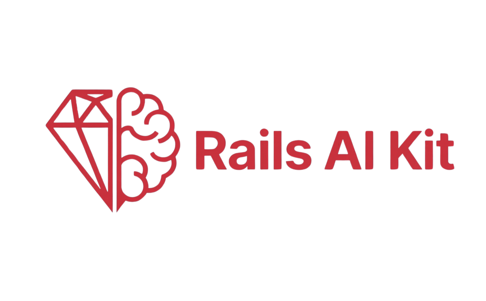

<div align="center">



### Build Modern Web Apps Faster

A production-ready starter kit combining Ruby on Rails with React, TypeScript, and AI integrations.

[](https://rubyonrails.org/)
[](https://react.dev/)
[](https://www.typescriptlang.org/)
[](LICENSE)

</div>

---

## ✨ Features

### Core Stack
- **Inertia.js** — Modern monolith SPA architecture
- **Vite** — Lightning-fast builds and HMR
- **React + TypeScript** — Type-safe UI development
- **shadcn/ui** — Beautiful, accessible components
- **TailwindCSS** — Utility-first styling
- **Authentication Zero** — Auth out of the box
- **Kamal** — Zero-downtime deployments

### AI & Integrations
- **FastMCP** — Model Context Protocol for AI assistants
- **ruby_llm** — Multi-provider LLM support (OpenAI, Anthropic, Gemini)
- **Stripe** — Payment processing & subscriptions
- **Postmark** — Transactional email delivery
- **Sentry** — Error tracking and monitoring

---

## 🚀 Quick Start

```bash
# Clone the repository
git clone https://github.com/AAlvAAro/rails-ai-kit.git
cd rails-ai-kit

# Install dependencies and setup database
bin/setup

# Start the development server
bin/dev

# Open http://localhost:3000
```

---

## 📖 Documentation

Visit `/docs` in your running application for detailed setup instructions including:

- Environment variables configuration
- Stripe setup and billing
- AI integration (ruby_llm, FastMCP)
- Email configuration (Postmark)
- Deployment with Kamal
- Server-side rendering (SSR)

---

## ⚙️ Enabling SSR

Open `app/frontend/entrypoints/inertia.ts` and uncomment:

```ts
if (el.hasChildNodes()) {
  hydrateRoot(el, createElement(App, props))
  return
}
```

Open `config/deploy.yml` and uncomment:

```yml
servers:
  vite_ssr:
    hosts:
      - 192.168.0.1
    cmd: bundle exec vite ssr
    options:
      network-alias: vite_ssr

env:
  clear:
    INERTIA_SSR_ENABLED: true
    INERTIA_SSR_URL: "http://vite_ssr:13714"

builder:
  dockerfile: Dockerfile-ssr
```

---

## 📜 License

[MIT License](https://opensource.org/licenses/MIT) — Forked from [inertia-rails/react-starter-kit](https://github.com/inertia-rails/react-starter-kit)
